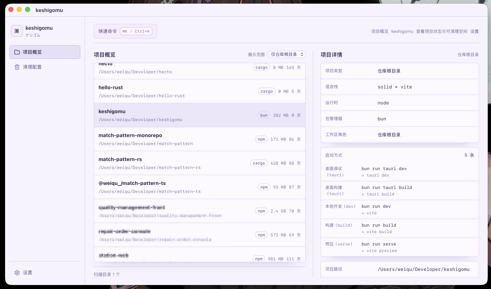
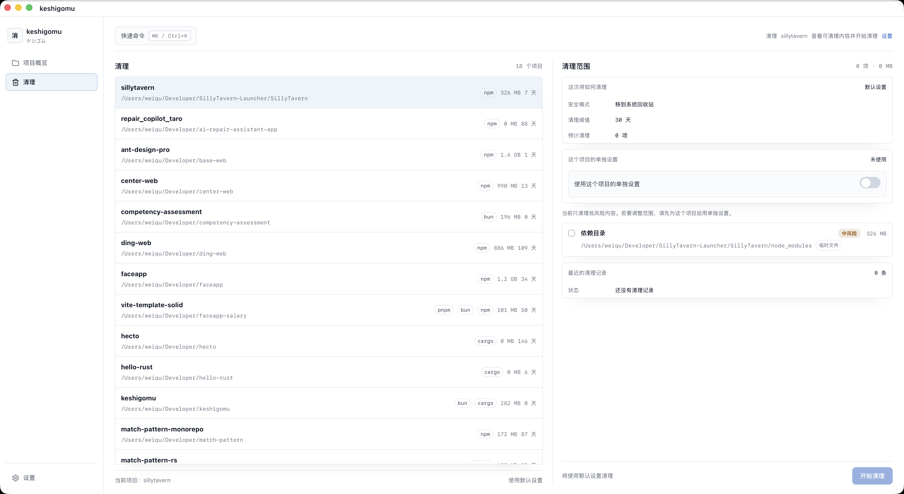
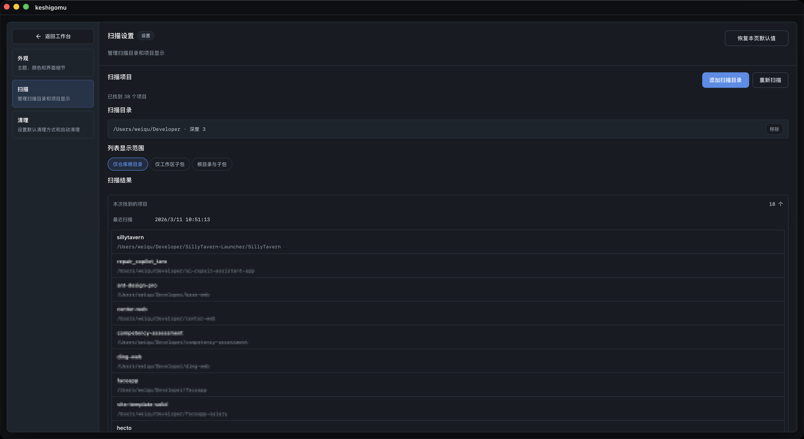
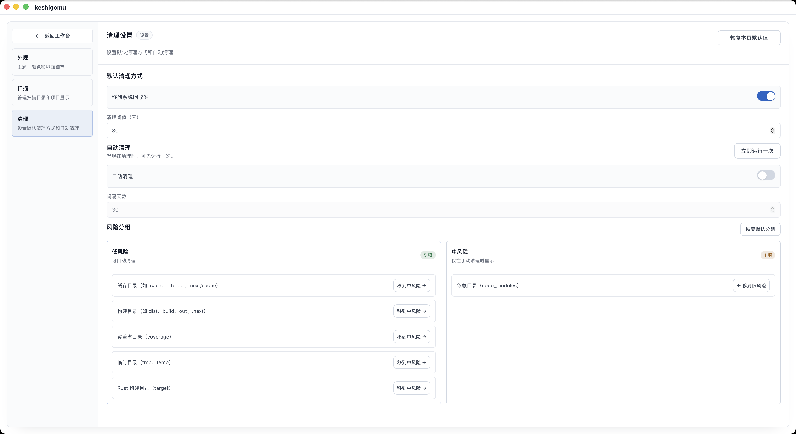
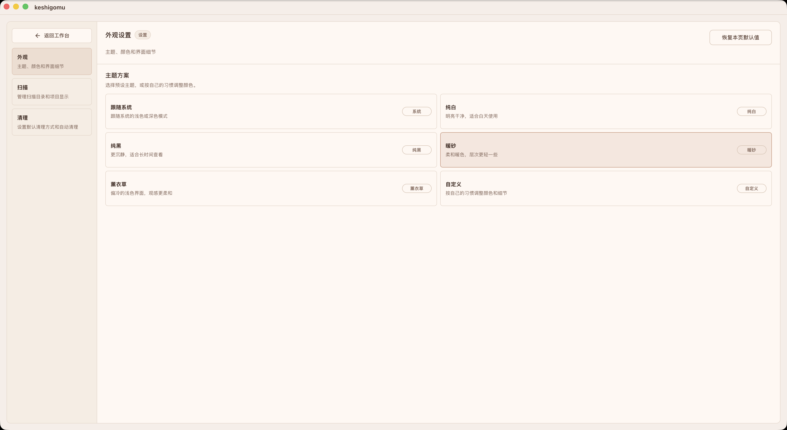

  

# keshigomu

> Warning: powered by ChatGPT  
> 警告：项目由 ChatGPT 驱动。

Currently macOS only.  
当前仅支持 macOS。

`keshigomu` 是一个面向前端工程师和 Rust 开发者的桌面工具，用来整理本地项目。它会先扫描工作区，补齐项目信息，再在项目范围内给出清理计划，而不是直接开始删除。  
`keshigomu` is a desktop tool for frontend engineers and Rust developers who want to keep local projects organized. It scans your workspace, fills in project context, and gives you a project-level cleanup plan before anything is removed.

## 处理什么问题 / What It Solves

本地仓库一多，麻烦往往不在删除动作本身，而在判断。哪些项目最近还在用，哪些目录只是缓存，哪些内容删掉以后只是重新生成，哪些内容最好不要碰，这些问题很难靠记忆解决。`keshigomu` 不做整盘级别的清理，而是把整理动作放回具体项目里处理。  
When you have a lot of local repos, the hard part is usually not deleting files. The hard part is deciding what is safe to delete. Which projects are still active, which folders are just cache, what can be regenerated, and what should be left alone. `keshigomu` does not try to clean your whole disk. It keeps cleanup tied to real projects.

## 现在能做什么 / What It Can Do Today

整个流程围绕同一个目标展开：先把项目整理清楚，再决定怎么清理。  
The workflow is simple: understand the project first, then decide what to clean.

- `项目发现 / Project discovery`：按目录和深度扫描本地工程，从 `package.json`、`pnpm-workspace.yaml`、`Cargo.toml`、`pyproject.toml` 这些标记识别项目，并区分仓库根目录、工作区子包和独立项目。对于 monorepo，列表可以只看根目录、只看子包，或者同时显示两者。  
  Scan local directories by root and depth, detect projects from markers such as `package.json`, `pnpm-workspace.yaml`, `Cargo.toml`, and `pyproject.toml`, and classify them as repo roots, workspace packages, or standalone projects. For monorepos, you can view only roots, only packages, or both.
- `项目画像 / Project overview`：补齐路径、项目类型、框架与构建工具、运行时、包管理器、工作区角色、工作区子项数量、常用启动命令、最近活跃天数和预计可释放空间。前端项目主要根据 `package.json scripts` 推断命令，Rust 项目则识别 `cargo run` 和 `cargo build`。  
  Show the path, project type, frameworks, build tools, runtime, package manager, workspace role, workspace unit count, common startup commands, last active days, and estimated reclaimable space. For frontend projects, commands are mainly inferred from `package.json` scripts. For Rust projects, `cargo run` and `cargo build` are recognized.
- `清理计划 / Cleanup plan`：按项目生成可清理条目，而不是把整个磁盘上的大目录混在一起。每个条目都会给出名称、相对路径、分类、风险等级、预计释放空间，以及是否推荐默认选中。当前重点覆盖前端缓存目录、构建产物目录、测试覆盖率目录、临时文件、`node_modules`，以及 Rust `target`。  
  Generate cleanup items per project instead of mixing everything across the disk. Each item includes a label, relative path, category, risk level, estimated size, and whether it should be selected by default. Current coverage focuses on frontend cache folders, build outputs, coverage folders, temp files, `node_modules`, and Rust `target`.
- `清理策略 / Cleanup policy`：支持全局默认设置和项目单独设置。可以分别控制默认清理方式、清理阈值、自动清理间隔、风险分组、项目不活跃阈值、缓存时间阈值，以及是否启用安全模式。  
  Support both global defaults and per-project overrides. You can control the default cleanup mode, cleanup threshold, auto cleanup interval, risk grouping, inactive-project threshold, cache age threshold, and safe mode.
- `执行结果与历史 / Results and history`：执行之后会返回处理项目数、处理条目数、释放空间、已清理路径，以及失败路径和失败原因；历史记录会持续保留这些结果，并区分手动执行和自动执行。  
  After a run, you can see how many projects and items were processed, how much space was freed, which paths were removed, and which paths failed with reasons. The same information is kept in history, with manual and automatic runs shown separately.

## 界面预览 / Screenshots

项目概览页会先把本地项目整理成一份可浏览的列表，再补齐当前项目的基本信息、启动命令和预计可释放空间。  
The overview page turns local repos into something you can browse first, then fills in project details, common commands, and estimated reclaimable space.

清理页会把清理动作限制在当前项目里，先给出条目、风险和空间预估，再决定要不要执行。  
The cleanup page keeps the scope inside the current project. It shows cleanup items, risk level, and estimated size before you decide what to run.

扫描设置页用于管理扫描目录、展示范围和最近一次扫描结果。  
The scan settings page is where scan roots, list scope, and recent scan results are managed.

清理设置页集中放默认清理方式、自动清理和风险分组。  
The cleanup settings page keeps default cleanup behavior, auto cleanup, and risk grouping in one place.

外观设置页提供预设主题，也支持继续往下做自定义。  
The appearance settings page includes preset themes and leaves room for deeper customization.

## 安全边界 / Safety Boundaries

当前实现把清理动作限制在几条明确的边界里，避免把“整理”变成一次不透明的删除操作。  
Cleanup is intentionally limited by a few clear rules.

- 清理前必须先生成项目级计划，再从这份计划里选择条目。  
  A project-level plan is generated first, and cleanup starts from that plan.
- 默认执行方式是安全模式，优先移入系统回收站；如果系统不支持，会转入应用托管的安全目录。  
  Safe mode is the default. Files are moved to the system Trash first. If that is not available, they go to an app-managed safe location.
- 自动清理只处理低风险项；缓存类条目还需要满足缓存时间阈值，项目本身也需要满足不活跃天数阈值。  
  Auto cleanup only touches low-risk items. Cache items also have to pass the cache age threshold, and the project itself has to pass the inactive-days threshold.
- 清理条目必须落在项目根目录内。  
  Cleanup items must stay inside the project root.
- 每次执行都会保留结果和历史，便于回看。  
  Every run keeps results and history for review.

## 技术栈 / Tech Stack

前端使用 SolidJS 和 TypeScript，桌面容器使用 Tauri 2，本地扫描、规则判断、清理执行和历史记录由 Rust 负责，界面样式基于 Tailwind CSS 4、Kobalte 和 Lucide。  
The frontend is built with SolidJS and TypeScript. The desktop shell uses Tauri 2. Local scanning, rule evaluation, cleanup execution, and history storage are handled in Rust. The UI uses Tailwind CSS 4, Kobalte, and Lucide.

## 测试与验证 / Testing and Verification

当前仓库已经把前端状态逻辑、Tauri 命令边界和 Rust 核心规则接进了统一测试流程。日常使用时按下面这组命令即可。  
The repository already includes a single test flow for frontend state logic, Tauri command boundaries, and core Rust rules. These are the commands used in day-to-day development.

- `bun run test`：运行前端测试，覆盖设置快照、扫描状态、清理状态和 Tauri 客户端调用。  
  Run frontend tests for settings snapshots, scan state, cleanup state, and Tauri client calls.
- `bun run test:coverage`：生成前端覆盖率报告，并输出到 `coverage/`。  
  Generate frontend coverage output in `coverage/`.
- `bun run test:rust`：运行 `src-tauri` 的 Rust 单元测试。  
  Run Rust unit tests in `src-tauri`.
- `bun run test:verify`：提交前推荐执行，串跑前端测试、Rust 测试和 TypeScript 检查。  
  Recommended before commits; runs frontend tests, Rust tests, and TypeScript checks together.
- `bun run test:release`：在 `test:verify` 基础上再执行一次前端生产构建，适合发版前使用。  
  Runs `test:verify` and then builds the frontend for production.

这套流程当前重点保护这些行为：  
Current coverage mainly protects these behaviors:

- 设置加载、快照归档和自动扫描触发条件。  
  Settings loading, snapshot persistence, and auto-scan triggers.
- 扫描目录归一化、超时反馈和原生目录选择。  
  Scan root normalization, timeout feedback, and native directory picking.
- 清理计划风险映射、项目级覆盖和队列同步。  
  Cleanup plan risk mapping, project-level overrides, and queue sync.
- Tauri `invoke` 命令名和 payload 契约。  
  Tauri `invoke` command names and payload contracts.
- 自动清理和设置归一化等 Rust 决策逻辑。  
  Rust-side decisions such as auto cleanup and settings normalization.

## 当前范围 / Current Scope

当前版本聚焦项目级整理，不做泛用磁盘清理，也不把全局包管理器缓存回收作为主功能。  
The current version focuses on project-level cleanup. It is not meant to be a general disk cleaner, and global package manager cache cleanup is not the main use case.

## 路线图 / Roadmap

当前版本已经覆盖了项目扫描、项目画像、清理计划和清理执行。接下来会优先补齐平台支持，以及把现有信息进一步转成可直接操作的能力。  
The current version already covers project discovery, project overview, cleanup planning, and cleanup execution. Next steps are mainly broader platform support and a few workflow improvements.

- [ ] Windows 支持 / Windows support
- [ ] Linux 支持 / Linux support
- [ ] 从项目概览直接运行常用命令 / Run common commands directly from the project overview
- [ ] 窄窗口下的布局与信息密度优化 / Better layout and information density in narrow windows
- [ ] 项目环境提示：识别包管理器冲突、命令缺失和工作区结构异常 / Project environment hints for package manager conflicts, missing commands, and broken workspace structure
